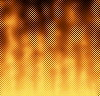



## Real\-time fire \(updated, 100 FPS\)

### Description

This program simulates fire. I have seen other articles that simulate fire, but this one is extremely fast (95-102 FPS on my 366) and it uses some neat API calls that most programmers probably have never seen before. I uploaded this before, but it only worked if your computer was in 24-bit colormode. I have changed it so that anyone running in 16, 24, or 32-bit colormode can see the fire perfectly. I really want to know what you think of my program. I have commented it heavily so even a beginner should be able to understand what each line does. I really hope that you will vote and leave comments, I have worked really hard to make this compatible and also the get such a high FPS so please let me know what you think.
 
### More Info
 

             |
---                |---
**Submitted On**   |2000-11-28 20:49:04
**By**             |[Odin](https://github.com/Planet-Source-Code/PSCIndex/blob/master/ByAuthor/odin.md)
**Level**          |Advanced
**User Rating**    |4.6 (172 globes from 37 users)
**Compatibility**  |VB 5\.0, VB 6\.0
**Category**       |[Graphics](https://github.com/Planet-Source-Code/PSCIndex/blob/master/ByCategory/graphics__1-46.md)
**World**          |[Visual Basic](https://github.com/Planet-Source-Code/PSCIndex/blob/master/ByWorld/visual-basic.md)
**Archive File**   |[CODE\_UPLOAD1216911282000\.zip](https://github.com/Planet-Source-Code/odin-real-time-fire-updated-100-fps__1-13194/archive/master.zip)

### API Declarations

A few

